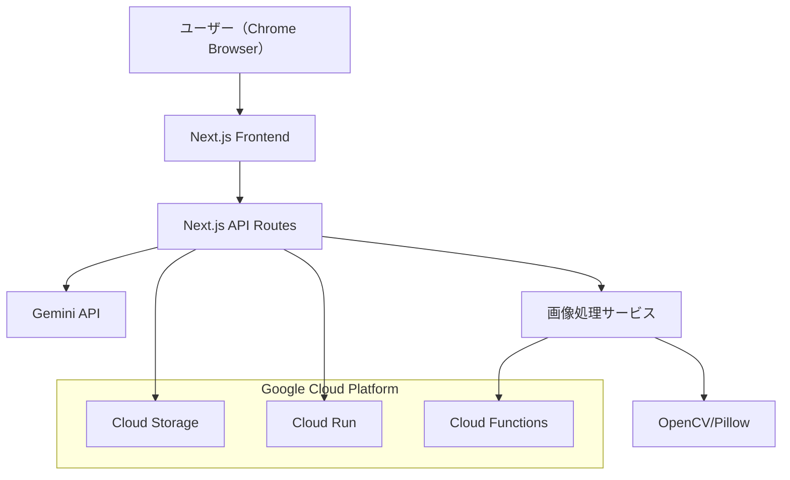
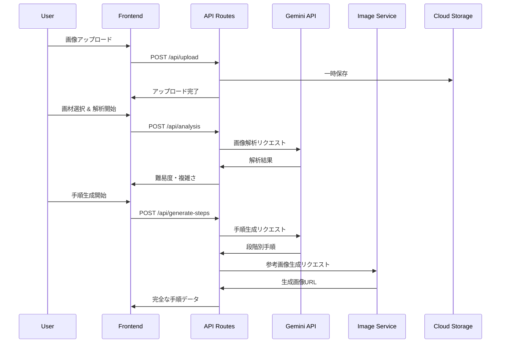
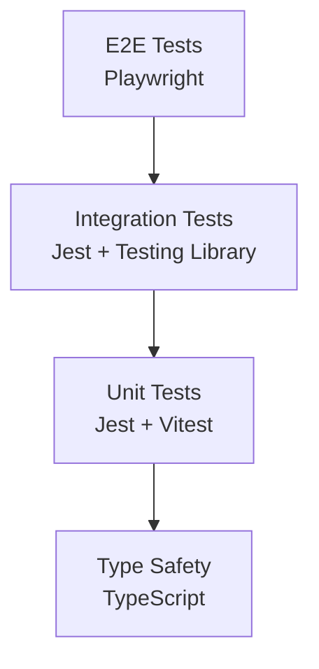

# AI 絵画指導アプリ 設計書

## 概要

AI 絵画指導アプリは、Next.js App Router を基盤とし、Google Cloud Platform 上で動作するサーバーレスアーキテクチャを採用します。Gemini API による画像解析と手順生成、OpenCV/Pillow による参考画像生成を組み合わせ、初心者向けの段階的絵画指導を提供します。

## アーキテクチャ

### システム全体構成



### 技術スタック

**フロントエンド:**

- Next.js 14+ (App Router)
- TypeScript
- Tailwind CSS
- React Hook Form (フォーム管理)
- Zustand (状態管理)

**バックエンド:**

- Next.js API Routes
- Cloud Functions (画像処理)
- Cloud Run (メインアプリケーション)

**AI・画像処理:**

- Gemini API (画像解析・手順生成)
- OpenCV (Python) - Cloud Functions
- Pillow (Python) - 画像変換・圧縮

**インフラ:**

- Google Cloud Run (コンテナデプロイ)
- Google Cloud Functions (画像処理)
- Google Cloud Storage (一時ファイル保存)

## コンポーネントとインターフェース

### フロントエンドコンポーネント構成

```
src/
├── app/
│   ├── page.tsx                 # メイン画面
│   ├── analysis/
│   │   └── page.tsx            # 解析結果画面
│   ├── tutorial/
│   │   └── page.tsx            # 指導画面
│   └── layout.tsx              # 共通レイアウト
├── components/
│   ├── ImageUpload.tsx         # 画像アップロード
│   ├── MaterialSelector.tsx    # 画材選択
│   ├── DifficultyDisplay.tsx   # 難易度表示
│   ├── StepGuide.tsx          # ステップガイド
│   ├── ProgressBar.tsx        # 進捗表示
│   └── ErrorBoundary.tsx      # エラーハンドリング
├── hooks/
│   ├── useImageUpload.ts      # 画像アップロード管理
│   ├── useAnalysis.ts         # 解析状態管理
│   └── useTutorial.ts         # チュートリアル状態管理
├── services/
│   ├── api.ts                 # API呼び出し
│   ├── imageProcessor.ts      # 画像処理ユーティリティ
│   └── storage.ts             # ローカルストレージ管理
└── types/
    ├── tutorial.ts            # チュートリアル型定義
    ├── analysis.ts            # 解析結果型定義
    └── api.ts                 # API型定義
```

### API エンドポイント設計

```typescript
// API Routes構成
/api/
├── upload              # POST: 画像アップロード
├── analysis           # POST: AI画像解析・難易度判定
├── generate-steps     # POST: 手順生成
├── generate-images    # POST: 参考画像生成
└── health            # GET: ヘルスチェック
```

## データモデル

### 型定義

```typescript
// 画材タイプ
type Material = "pencil" | "watercolor" | "colored-pencil" | "acrylic";

// 難易度レベル
type DifficultyLevel = "beginner" | "intermediate" | "advanced";

// 解析結果
interface AnalysisResult {
  id: string;
  difficulty: DifficultyLevel;
  complexity: number;
  subjects: string[];
  estimatedTime: number;
  reasoning: string;
  createdAt: Date;
}

// 描画ステップ
interface DrawingStep {
  stepNumber: number;
  title: string;
  description: string;
  tips: string[];
  referenceImageUrl: string;
  estimatedDuration: number;
}

// チュートリアルセッション
interface TutorialSession {
  id: string;
  originalImageUrl: string;
  material: Material;
  analysisResult: AnalysisResult;
  steps: DrawingStep[];
  currentStep: number;
  startedAt: Date;
  completedAt?: Date;
}

// API レスポンス型
interface ApiResponse<T> {
  success: boolean;
  data?: T;
  error?: {
    code: string;
    message: string;
  };
}
```

### データフロー



## エラーハンドリング

### エラー分類と対応

```typescript
// エラータイプ定義
enum ErrorType {
  UPLOAD_ERROR = "UPLOAD_ERROR",
  ANALYSIS_ERROR = "ANALYSIS_ERROR",
  GENERATION_ERROR = "GENERATION_ERROR",
  NETWORK_ERROR = "NETWORK_ERROR",
  TIMEOUT_ERROR = "TIMEOUT_ERROR",
  VALIDATION_ERROR = "VALIDATION_ERROR",
}

// エラーハンドリング戦略
interface ErrorHandlingStrategy {
  [ErrorType.UPLOAD_ERROR]: {
    retry: true;
    maxRetries: 3;
    userMessage: "ファイルのアップロードに失敗しました。再試行してください。";
  };
  [ErrorType.ANALYSIS_ERROR]: {
    retry: true;
    maxRetries: 2;
    userMessage: "画像の解析に失敗しました。別の画像をお試しください。";
  };
  [ErrorType.GENERATION_ERROR]: {
    retry: true;
    maxRetries: 2;
    userMessage: "手順の生成に失敗しました。しばらく待ってから再試行してください。";
  };
  [ErrorType.NETWORK_ERROR]: {
    retry: true;
    maxRetries: 5;
    userMessage: "ネットワーク接続を確認してください。";
  };
  [ErrorType.TIMEOUT_ERROR]: {
    retry: false;
    userMessage: "処理に時間がかかりすぎています。画像サイズを小さくしてお試しください。";
  };
}
```

### 回復戦略

1. **自動リトライ**: ネットワークエラー、一時的な API 障害
2. **ユーザー主導リトライ**: 解析失敗、生成失敗
3. **代替手段提示**: タイムアウト時の画像サイズ縮小提案
4. **グレースフルデグラデーション**: 参考画像生成失敗時のテキストのみ表示

## テスト戦略

### テストピラミッド



### テスト範囲

**Unit Tests (70%)**

- コンポーネント単体テスト
- カスタムフック テスト
- ユーティリティ関数テスト
- API 関数テスト

**Integration Tests (20%)**

- API Routes テスト
- コンポーネント間連携テスト
- 外部サービス統合テスト（モック使用）

**E2E Tests (10%)**

- 主要ユーザーフロー
- 画像アップロード → 解析 → 手順表示
- エラーケースの動作確認

### テスト環境

```typescript
// テスト設定例
// jest.config.js
module.exports = {
  testEnvironment: "jsdom",
  setupFilesAfterEnv: ["<rootDir>/jest.setup.js"],
  moduleNameMapping: {
    "^@/(.*)$": "<rootDir>/src/$1",
  },
  collectCoverageFrom: [
    "src/**/*.{ts,tsx}",
    "!src/**/*.d.ts",
    "!src/**/*.stories.tsx",
  ],
  coverageThreshold: {
    global: {
      branches: 80,
      functions: 80,
      lines: 80,
      statements: 80,
    },
  },
};
```

## パフォーマンス最適化

### フロントエンド最適化

1. **画像最適化**

   - Next.js Image コンポーネント使用
   - WebP 形式への自動変換
   - 遅延読み込み実装

2. **コード分割**

   - ページレベルでの動的インポート
   - 重いライブラリの遅延読み込み

3. **キャッシュ戦略**
   - SWR による API キャッシュ
   - ブラウザキャッシュ活用

### バックエンド最適化

1. **API 最適化**

   - レスポンス圧縮
   - 適切な HTTP ステータスコード
   - リクエスト/レスポンスサイズ最小化

2. **画像処理最適化**
   - 並列処理による高速化
   - 適切な画像圧縮
   - CDN 活用

### 画像処理最適化

```typescript
// シンプルな画像処理ユーティリティ
export class ImageProcessor {
  // 画像の最適化とリサイズ
  static async optimizeImage(
    buffer: Buffer,
    maxWidth = 800,
    maxHeight = 600
  ): Promise<Buffer> {
    return sharp(buffer)
      .resize(maxWidth, maxHeight, {
        fit: "inside",
        withoutEnlargement: true,
      })
      .jpeg({ quality: 85 })
      .toBuffer();
  }

  // 画像メタデータの除去
  static async sanitizeImage(buffer: Buffer): Promise<Buffer> {
    return sharp(buffer).removeMetadata().toBuffer();
  }

  // 画像形式の統一
  static async convertToWebP(buffer: Buffer): Promise<Buffer> {
    return sharp(buffer).webp({ quality: 80 }).toBuffer();
  }
}

// 参考画像の準備（元画像をそのまま使用）
async function prepareReferenceImage(originalBuffer: Buffer): Promise<string> {
  const optimized = await ImageProcessor.optimizeImage(originalBuffer);
  const sanitized = await ImageProcessor.sanitizeImage(optimized);

  // Base64エンコードまたはCloud Storageに保存
  return `data:image/jpeg;base64,${sanitized.toString("base64")}`;
}
```

## セキュリティ考慮事項

### データ保護

1. **画像データ保護**

   - HTTPS 通信の強制
   - 一時ファイルの自動削除
   - アクセストークンによる認証

2. **API セキュリティ**

   - レート制限実装
   - 入力値検証
   - CORS 設定

3. **プライバシー保護**
   - 画像メタデータの除去
   - ログからの機密情報除外
   - 利用規約での明確な説明

### 実装例

```typescript
// セキュリティミドルウェア
import { NextRequest, NextResponse } from "next/server";
import rateLimit from "express-rate-limit";

// レート制限
const limiter = rateLimit({
  windowMs: 15 * 60 * 1000, // 15分
  max: 100, // 最大100リクエスト
  message: "Too many requests from this IP",
});

// 入力値検証
export function validateImageUpload(file: File): boolean {
  const allowedTypes = ["image/jpeg", "image/png", "image/webp"];
  const maxSize = 5 * 1024 * 1024; // 5MB

  return allowedTypes.includes(file.type) && file.size <= maxSize;
}

// メタデータ除去
export function sanitizeImage(imageBuffer: Buffer): Buffer {
  // EXIF データ等の除去処理
  return processedBuffer;
}
```

この設計書では、Google Cloud 環境での制約を考慮し、スケーラブルで保守性の高いアーキテクチャを提案しています。Next.js App Router を活用したモダンな開発手法と、適切なエラーハンドリング、パフォーマンス最適化、セキュリティ対策を含んでいます。

<!-- 将来の拡張: 高度な画像処理機能

## 画像処理アルゴリズム詳細

### 1. 線画生成（Line Art）
- グレースケール変換→軽いぼかし→XDoG/Canny輪郭抽出→反転処理で「白地に黒線」

### 2. ベース色生成（Flat Color / 塗り絵ガイド）
- RGB→Lab変換→K-means(k=6-12)減色→面分けベタ塗り→Canny輪郭1px重ね合わせ

### 3. ハイライト生成（Highlight Layer）
- LabのLチャンネル上位10-15%抽出→透明白オーバーレイ用PNG

実装詳細は将来のバージョンで追加予定
-->

## タイムアウト・パフォーマンス対策

### 画像処理最適化

```typescript
// 画像の事前最適化
async function preprocessImage(buffer: Buffer): Promise<Buffer> {
  return sharp(buffer)
    .resize(800, 600, {
      fit: "inside",
      withoutEnlargement: true,
    })
    .jpeg({ quality: 80 })
    .toBuffer();
}

// Gemini API呼び出しのタイムアウト対策
async function analyzeImageWithTimeout(
  imageBuffer: Buffer
): Promise<AnalysisResult> {
  const optimizedImage = await preprocessImage(imageBuffer);

  const controller = new AbortController();
  const timeoutId = setTimeout(() => controller.abort(), 20000); // 20秒タイムアウト

  try {
    const result = await fetch(geminiApiUrl, {
      method: "POST",
      body: optimizedImage,
      signal: controller.signal,
      headers: { "Content-Type": "image/jpeg" },
    });

    clearTimeout(timeoutId);
    return await result.json();
  } catch (error) {
    clearTimeout(timeoutId);

    if (error.name === "AbortError") {
      // タイムアウト時のフォールバック
      return {
        difficulty: "beginner",
        reasoning:
          "画像解析がタイムアウトしました。初級レベルとして設定します。",
        complexity: 3,
        subjects: ["一般的な画像"],
        estimatedTime: 60,
      };
    }
    throw error;
  }
}
```

### エラーハンドリング強化

```typescript
// 段階的フォールバック戦略
class RobustImageAnalyzer {
  async analyze(imageBuffer: Buffer): Promise<AnalysisResult> {
    try {
      // 1. 通常の解析を試行
      return await this.fullAnalysis(imageBuffer);
    } catch (error) {
      console.warn("Full analysis failed, trying simplified analysis:", error);

      try {
        // 2. 簡易解析を試行
        return await this.simplifiedAnalysis(imageBuffer);
      } catch (error) {
        console.warn("Simplified analysis failed, using fallback:", error);

        // 3. フォールバック（デフォルト値）
        return this.getFallbackResult();
      }
    }
  }

  private getFallbackResult(): AnalysisResult {
    return {
      difficulty: "beginner",
      reasoning:
        "システムの問題により自動判定できませんでした。初級レベルで開始してください。",
      complexity: 3,
      subjects: ["画像"],
      estimatedTime: 45,
    };
  }
}
```

### パフォーマンス監視

```typescript
// 処理時間の監視
async function monitoredApiCall<T>(
  operation: () => Promise<T>,
  operationName: string
): Promise<T> {
  const startTime = Date.now();

  try {
    const result = await operation();
    const duration = Date.now() - startTime;

    console.log(`${operationName} completed in ${duration}ms`);

    if (duration > 15000) {
      console.warn(`${operationName} took longer than expected: ${duration}ms`);
    }

    return result;
  } catch (error) {
    const duration = Date.now() - startTime;
    console.error(`${operationName} failed after ${duration}ms:`, error);
    throw error;
  }
}
```

## AI 画像生成機能（Gemini 2.5 Flash Image）

### Gemini Image Generation Service

```typescript
// Gemini 2.5 Flash Image統合サービス
export class GeminiImageService {
  private model = genAI.getGenerativeModel({
    model: "gemini-2.5-flash-image-preview",
  });

  // 4種類の画像を並列生成
  async generateAllVariations(
    imageBuffer: Buffer,
    material: Material,
    textureStrength: number = 40
  ): Promise<GeneratedImages> {
    const base64Image = imageBuffer.toString("base64");

    const [lineArt, flatColor, highlight, paintedSample] = await Promise.all([
      this.generateLineArt(base64Image),
      this.generateFlatColor(base64Image, material, textureStrength),
      this.generateHighlight(base64Image, material, textureStrength),
      this.generatePaintedSample(base64Image, material, textureStrength),
    ]);

    return { lineArt, flatColor, highlight, paintedSample };
  }

  // 線画生成
  private async generateLineArt(base64Image: string): Promise<Buffer> {
    const prompt = `
入力画像を白背景の黒い線画だけに変換してください。
- 色・グレーの濃淡・テクスチャは禁止
- 滑らかで連続した線、アニメ／マンガ風の均一ストローク
- 構図・比率は厳密に維持
- PNG 1枚で出力
- No text, no watermark, no extra objects
- Keep composition and proportions of the input
- Avoid artifacts and banding
- Do not change character identity, pose, facial features, or layout
    `;

    return this.callGeminiImageAPI(base64Image, prompt);
  }

  // ベタ塗り生成（画材質感＝弱）
  private async generateFlatColor(
    base64Image: string,
    material: Material,
    textureStrength: number
  ): Promise<Buffer> {
    const materialTextures = {
      watercolor: `淡いにじみ／紙目を控えめ（${textureStrength}%）。色味はパステル寄り。`,
      acrylic: `筆致／インパスト（厚み）テクスチャを控えめ、発色やや強、グラデ最小限。`,
      "colored-pencil": `紙の粒子・方向性のある鉛筆タッチを控えめ、軽いハッチング感。`,
    };

    const prompt = `
8〜10色のポスタライズで面を塗り分ける。
細い黒輪郭線（1px相当）を境界に付与。
グラデーションや影は抑制（工程用のため色面主体）。
PNG 1枚で出力（不透明）。
${materialTextures[material] || ""}
- No text, no watermark, no extra objects
- Keep composition and proportions of the input
- Avoid artifacts and banding
- Do not change character identity, pose, facial features, or layout
    `;

    return this.callGeminiImageAPI(base64Image, prompt);
  }

  // ハイライト生成（画材質感＝反映）
  private async generateHighlight(
    base64Image: string,
    material: Material,
    textureStrength: number
  ): Promise<Buffer> {
    const materialHighlights = {
      watercolor: `抜き（リフト）やにじみ境界を控えめに。`,
      acrylic: `厚塗りの艶ハイライト（微細な筆跡反射）を控えめに。`,
      "colored-pencil": `白鉛筆の点描・紙目に沿うタッチを控えめに。`,
    };

    const prompt = `
白いハイライトのみを抽出した透明PNGで出力。その他は完全透過 (alpha=0)。
エッジはソフト、過度なグロー禁止。
${materialHighlights[material] || ""}
- No text, no watermark, no extra objects
- Keep composition and proportions of the input
- Avoid artifacts and banding
- Do not change character identity, pose, facial features, or layout
    `;

    return this.callGeminiImageAPI(base64Image, prompt);
  }

  // 色塗り見本生成（画材質感＝強）
  private async generatePaintedSample(
    base64Image: string,
    material: Material,
    textureStrength: number
  ): Promise<Buffer> {
    const materialStyles = {
      watercolor: `透明感、重ね（グレーズ）、にじみ、紙目。`,
      acrylic: `厚塗り、筆致、やや強い発色、わずかな光沢。`,
      "colored-pencil": `重ね塗り、ハッチング、紙粒子、柔らかいエッジ。`,
    };

    const prompt = `
${materialStyles[material]}
Flat/Highlight より質感を強めに適用。
PNG 1枚で出力。
- No text, no watermark, no extra objects
- Keep composition and proportions of the input
- Avoid artifacts and banding
- Do not change character identity, pose, facial features, or layout
    `;

    return this.callGeminiImageAPI(base64Image, prompt);
  }

  // Gemini API呼び出し（共通処理）
  private async callGeminiImageAPI(
    base64Image: string,
    prompt: string
  ): Promise<Buffer> {
    const controller = new AbortController();
    const timeoutId = setTimeout(() => controller.abort(), 30000);

    try {
      const result = await this.model.generateContent([
        {
          inlineData: {
            mimeType: "image/jpeg",
            data: base64Image,
          },
        },
        prompt,
      ]);

      clearTimeout(timeoutId);

      const response = result.response;
      const candidates = response.candidates;

      if (!candidates || candidates.length === 0) {
        throw new Error("No image generated");
      }

      // 画像パート（inlineData）を抽出
      const imagePart = candidates[0].content.parts.find(
        (part) =>
          part.inlineData && part.inlineData.mimeType.startsWith("image/")
      );

      if (!imagePart || !imagePart.inlineData) {
        throw new Error("No image data in response");
      }

      return Buffer.from(imagePart.inlineData.data, "base64");
    } catch (error) {
      clearTimeout(timeoutId);

      if (error.name === "AbortError") {
        throw new Error("TIMEOUT");
      }
      throw error;
    }
  }
}

// 生成画像の型定義
export interface GeneratedImages {
  lineArt: Buffer;
  flatColor: Buffer;
  highlight: Buffer;
  paintedSample: Buffer;
}

export interface ImageGenerationRequest {
  imageUrl: string;
  material: Material;
  textureStrength?: number;
}

export interface ImageGenerationResponse {
  images: {
    lineArt: string;
    flatColor: string;
    highlight: string;
    paintedSample: string;
  };
  material: Material;
  textureStrength: number;
}
```

### 既存システムとの統合

#### API Routes 統合

- `/api/generate-images` を拡張して Gemini 2.5 Flash Image 対応
- 既存のエラーハンドリング・タイムアウト処理を継承
- レスポンス形式は既存の ApiResponse<T>パターンを維持

#### UI 統合

- 既存の MaterialSelector コンポーネントを活用
- textureStrength 入力フィールドを既存デザインに合わせて追加
- 生成結果表示は既存の StepGuide コンポーネントを拡張

#### フォールバック戦略

- 生成失敗時は既存の ImageProcessor による簡易処理を使用
- タイムアウト時は元画像をそのまま参考画像として使用
- エラーメッセージは既存のエラーハンドリングパターンに統合
